# NetBox Automation - Zero to Hero

Welcome to NetBox Automation - Zero to Hero! In this workshop we will build a fully functioning intent-based network automation stack. While most vendors do a great job of showing you how to use their tool, network automation is a multi-tool adventure and there is lack of tutorials and documentation showing how everything fits together.

This workshop is intended to teach you the high-level concepts around intent-based networking, while also delivering you a fully functioning stack you can continue to experiment with. The workshop is split into sections covering different elements of the story. You should follow them sequentially.


## Sections

1. [Managing Networks the Hard Way](docs/1_Managing_Networks_The_Hard_Way.md) - A look at a "traditional" network management stack, and we'll discuss some of the issues with it.
2. [Introducing Intent-Based Network Automation](docs/2_Introducing_Intent_Based_Network_Automation.md) - A brief introduction to the high-level concepts that we'll be building through the rest of the workshop.
3. [Source of Truth: NetBox](docs/3_Source_Of_Truth_NetBox.md) - An introduction to NetBox, our Network Source of Truth that will drive our intent-based networking
4. [Discovery and Reconcilliation: Slurpit](docs/4_Discovery_Reconciliation_Slurpit.md)
5. [Monitoring: Icinga](docs/5_Monitoring_Icinga.md)
6. [Configuration Assurance: Netpicker](docs/6_Configuration_Assurance_Netpicker.md)
7. [Automated Network Changes: Ansible](docs/7_Automated_Network_Changes_Ansible.md)

# Initial Setup

See setup instructions here: [Link](docs/Setup.md)

# Workshop

## Moving towards Intent Based Networking

Much has been written about network automation and Intent Based Networking, so rather than adding to that, we're going to learn by doing. In the next sections we will introduce various modern tools and techniques make sure that changing our networks is less painful.

### NetBox - Our Network Source of Truth

A Network Source of Truth like [NetBox](https://netboxlabs.com/) is the bedrock of any network automation stategy. NetBox acts as your living documentation and captures the Low Level Design of your network, but initially our NetBox is empty (apart from a site called Slurpit, which you can ignore for now.)

Populating NetBox typically happens in two stages:

1. Set up the organizational specifics like tenants, sites, and more
2. Import our devices from the network

#### Set up the organizational specifics like tenants, sites, and more

For our network this step will be very simple as our devices will live in a single site called "Denver". Let's go and add that now. First we need to get the IP and port for NetBox.

```
echo ${MY_EXTERNAL_IP}:${NETBOX_PORT}
(Example output, yours will differ)
147.75.34.179:8001
```

> [!TIP]
> 
> **username** admin
> **password** admin

Now you can log-in and add the site under Organization -> Sites:


### Slurpit - Importing our devices from the network

**Discovering our Network with Slurpit**

Tools that are used to import operational state from our network into Netbox are typically called **Discovery** tools. Network Discovery typically falls into two categories:

1. Network discovery - Scans a list of IPs or subnets to find any network devices in the network
2. Device discovery - Logs into specific devices to extract their configurations

[Slurp'it](https://slurpit.io/) is a fully featured discovery tool. As the website says "If there’s a `show` command we can slurp’it!" Slurp'it can do network and device discovery across a large selection of network devices.

Let's slurp our network devices into Slurp'it using network discovery. First we need to get the IP and port for Slurp'it.

```
echo ${MY_EXTERNAL_IP}:${SLURPIT_PORT}
(Example output, yours will differ)
147.75.34.179:8000
```

> [!TIP]
> 
> **username** admin@admin.com  
> **password** 12345678

When you initially log in you will be presented with the Slurpit setup wizard.

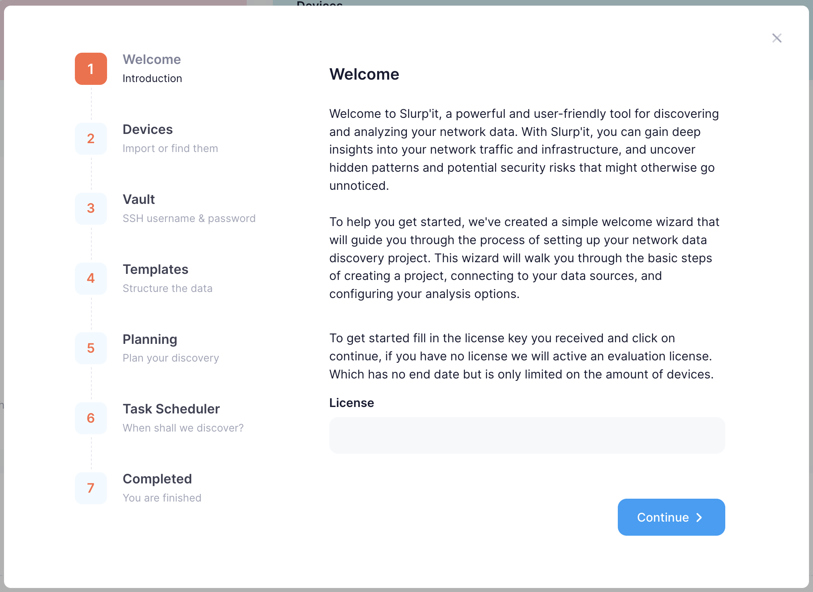

You can click through most of the steps, but you must populate the Vault step with the SSH credentials for our network devices.

> [!TIP]
> 
> **username** admin
> **password** NokiaSrl1!

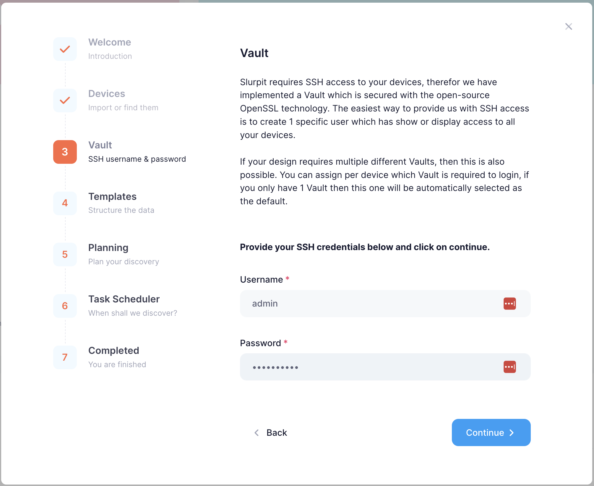

Click through the the final step, and then hit "Let's Go :rocket:"

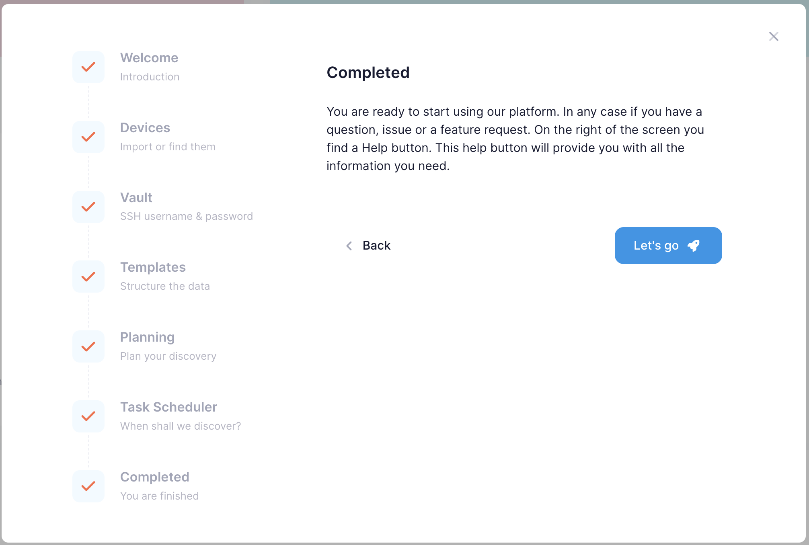

Now we need to discovery our devices in the network. Start by clicking on `Devices`, then `Device Finder`, and then under the `Finder` tab click on `+ Add`.

INSERT SCREENSHOT

Now configure your Device Finder with the values shown below.

>| Field | Value |
>|----------|----------|
>| Name | workshop-finder |
>| SNMP Version | snmpv3 |
>| Username | snmpuser |
>| Authtype | sha |
>| Authkey | snmppassword |
>| Privtype | aes128 |
>| Privkey | snmpprivpassword |
>| Target | 172.24.0.0/24 |

Then click on `Save`, and then `Start`.

___

Navigate back to `Devices` and you'll see our lab devices have been discovered in the network. Now we're ready to start our device discovery. Click on the ellipsis menu (three dots) on the far right side of each device and click `Schedule Now`.


Slurp'it will take a short while to discover information about our devices. Then you can view the discovered information by clicking on the new tab icon on each device, and navigating to the `Collected data` tab.

Feel free to explore the data Slurp'it has discovered about our devices. For example, under the `Interfaces` tab we can see the following:


___

**Importing the discovered network from Slurp'it into NetBox**

Now that Slurp'it has discovered our network, we need to import it into NetBox. The Slurp'it team have built a plugin for NetBox to help users intuitively reconcile the data in Slurp'it into NetBox, so let's dive in.

First navigate to your NetBox instance.

```
echo ${MY_EXTERNAL_IP}:${NETBOX_PORT}
(Example output, yours will differ)
147.75.34.179:8001
```

> [!TIP]
> 
> **username** admin
> **password** admin

In the NetBox left-hand menu click on `SLURP'IT` -> `Onboard devices`

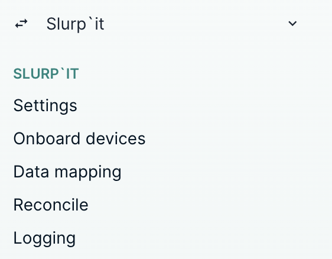

If you now click `Sync` the Slurp'it plugin will pull the devices it has discovered about our network over to NetBox.

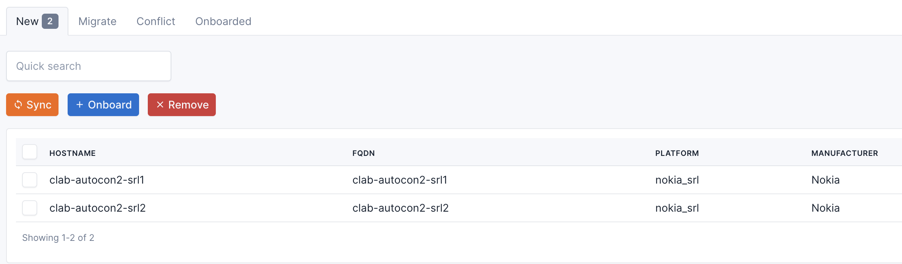

Now select both `clab-autocon2-srl1` and `clab-autocon2-srl2` click on `+ Onboard`. You'll see the Slurp'it device onboarding screen.

- Under `Management Interface*` enter `mgmt0`
- Under `Site*` select the `Denver`site that was pre-populated in NetBox
- Click `Apply`

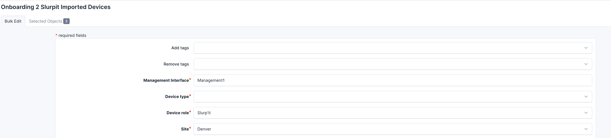

Now the devices in our network have been successfully imported into NetBox! You can confirm this by returning to the NetBox homepage and navigating to `Devices` -> `Devices`

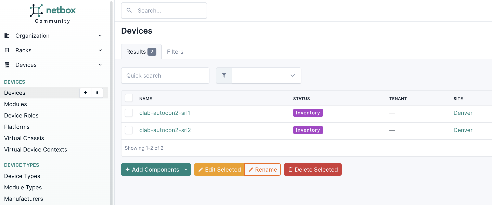

Pulling discovered network data into Netbox happens in two stages in Slurp'it. The step, which we just did, is to onboard the devices. The second step is to `Reconcile` the additional data about the devices into NetBox.

> [!TIP]
> 
> Slurp'it automatically pushes new data to be reconciled to NetBox every minute, but if you don't want to wait navigate to the following URLs in your browser  
> http://<INSERTYOURIP>:8000/run/plugin/sync  
> http://<INSERTYOURIP>:8000/run/plugin/sync_queue  

In the NetBox left-hand menu click on `SLURP'IT` -> `Reconcile`


Select the `IPAM` tab, select all the IPs and then click `Accept`.

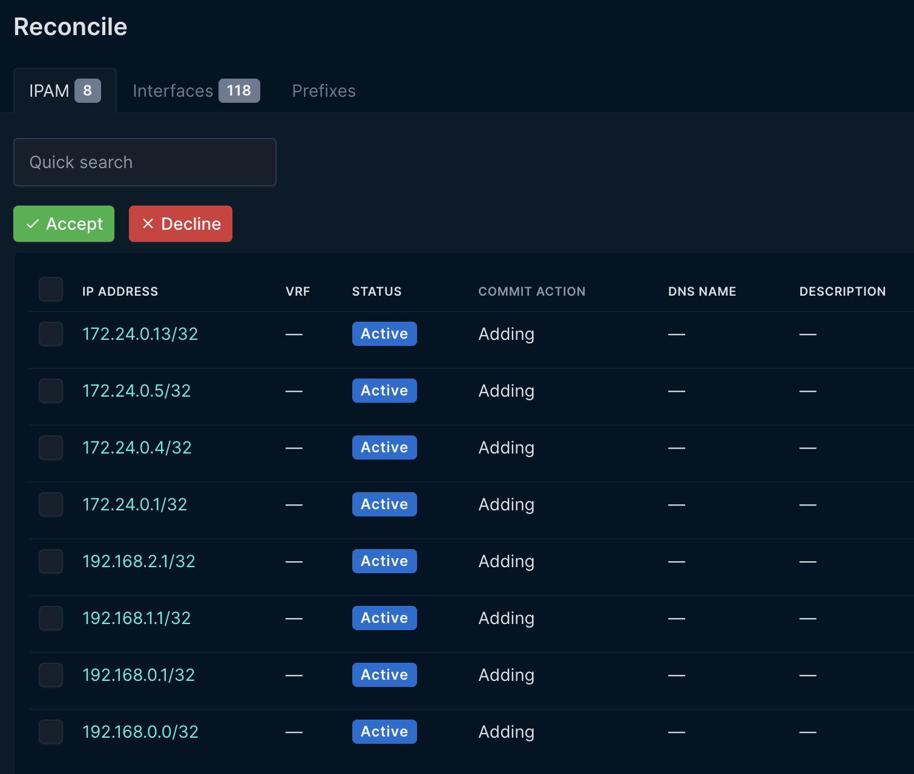

Select the `Interfaces` tab, select all the interfaces and then click `Accept`

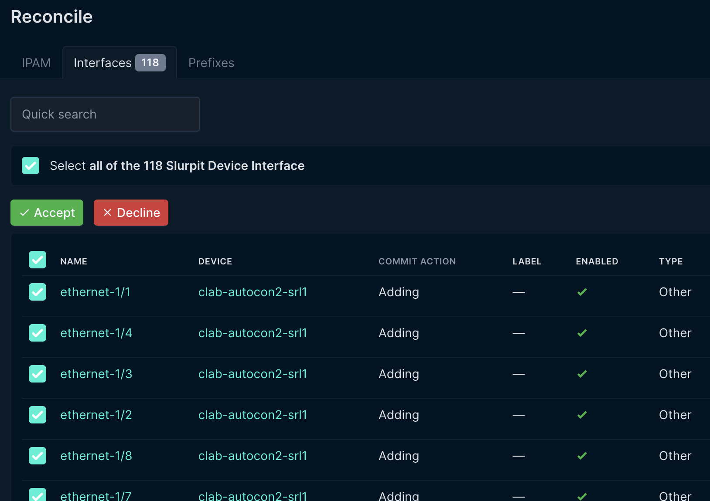

Now the device interfaces have been added to the devices in NetBox. To confirm, navigate to `Devices` -> `Devices` -> `clab-autocon2-srl1` and select the `Interfaces` tab.


____

### Icinga - Our monitoring tool


____

### Netpicker - Our configuration assurance tool

Netpicker allows us to validate our device configurations. It can be used to validate anything you can express in code, but also makes it easy to generate validations even if you can't code. Perhaps you'd like to know if there are any known vulnerabilities for a platform version you're running in your network, or if your device configurations adhere to your company's security policies? Netpicker can do all of that and more.

To get started we need to tell NetPicker about our devices. Now that we have NetBox as our Network Source of Truth, we'll be importing our devices from NetBox into Netpicker.

First log-in to Netpicker and click on `Add Device`

```
echo "http://${MY_EXTERNAL_IP}:${NETPICKER_PORT}"
(Example output, yours will differ)
http://139.178.74.171:8003
```

> [!TIP]
> 
> **username** admin@admin.com  
> **password** 12345678

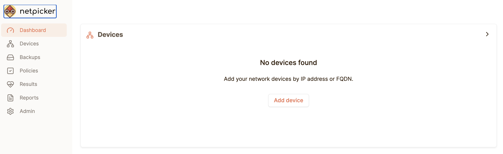

Now click on `+ Add devices` and then click on `Import from NetBox`

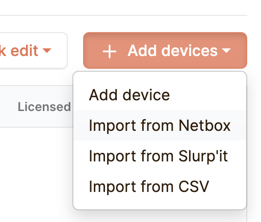

Then provide your NetBox URL, NetBox API key (1234567890) and click `Next`

```
echo "http://${MY_EXTERNAL_IP}:${NETBOX_PORT}"
(Example output, yours will differ)
http://139.178.74.171:8001
```


Then on the next screen choose `IP address / FQDN field (required)` choose `name (-)`and under `Vault` select `autocon_workshop`. Then click `Next`


Our network devices have now been imported from NetBox into Netpicker!

___

Next we need to ask Netpicker to pull the configuration backups for our devices so that we can run tests, which Netpicker calls `Policies`, against them.

On the `Devices` screen click `Run backups`

INSERT RUN BACKUPS SCREENSHOT

Navigate over to `Backups` and wait for the backups to arrive. You can hit `Refresh` to update the view until both backups report `Success`.

INSERT BACKUPS SCREENSHOT

You can now inspect the backups. Click on `clab-autocon2-srl1`. Then you can click on each backup to view it.

INSERT BACKUP DETAILS VIEW

Now that Netpicker is pulling the backups from our devices, we can use the real power of Netpicker, `Policies` and `Rules`.

