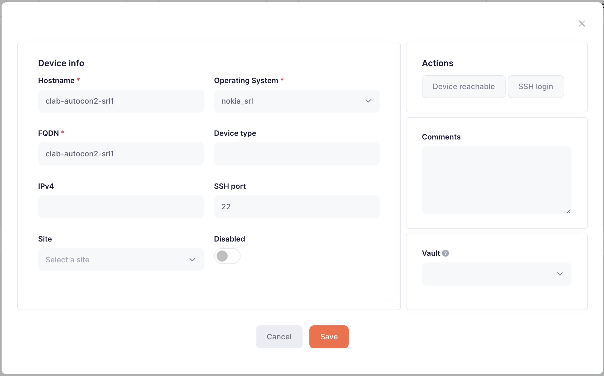
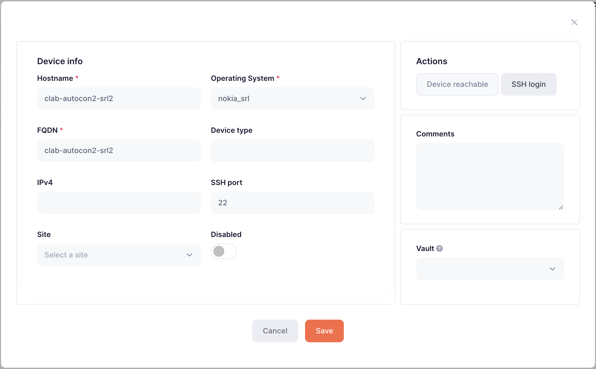

# Requirements

> [!TIP]
>  
> This workshop is resource intensive. We recommend using a machine with 16GB of RAM and 8 cores.

# Installation

> [!TIP]
>  
> Installation is straightforward, but takes about 10 minutes  

Follow the installation instructions here to get all the tooling installed: [Link](docs/Installation.md)

# Initial Setup

See setup instructions here: [Link](docs/Setup.md)

# Workshop

## Initial state

Let's explore the initial state. It's much like many traditional network setups: some devices, some monitoring and not a lot of documentation.

### Network

Let's take a look at our devices:

```
pushd network
clab inspect
INFO[0000] Parsing & checking topology file: autocon2.clab.yml 
+---+----------------------+--------------+-----------------------------------+---------------+---------+---------------+--------------+
| # |         Name         | Container ID |               Image               |     Kind      |  State  | IPv4 Address  | IPv6 Address |
+---+----------------------+--------------+-----------------------------------+---------------+---------+---------------+--------------+
| 1 | clab-autocon2-client | 1c78ef9c0455 | mrmrcoleman/autocon-client:latest | linux         | running | 172.24.0.6/24 | N/A          |
| 2 | clab-autocon2-server | 1edc76fbac02 | mrmrcoleman/autocon-server:latest | linux         | running | 172.24.0.9/24 | N/A          |
| 3 | clab-autocon2-srl1   | fb9cd192b40e | ghcr.io/nokia/srlinux:24.7.2      | nokia_srlinux | running | 172.24.0.7/24 | N/A          |
| 4 | clab-autocon2-srl2   | 1a5c96567133 | ghcr.io/nokia/srlinux:24.7.2      | nokia_srlinux | running | 172.24.0.8/24 | N/A          |
+---+----------------------+--------------+-----------------------------------+---------------+---------+---------------+--------------+
```

You can see that we have two Nokia SRLinux devices running in the network. Let's inspect one of them by ssh'ing into `clab-autocon2-srl1`.

> [!TIP]
> 
> **username** admin
> **password** NokiaSrl1!  

```
ssh admin@clab-autocon2-srl1
Warning: Permanently added 'clab-autocon2-srl1' (ED25519) to the list of known hosts.
................................................................
:                  Welcome to Nokia SR Linux!                  :
:              Open Network OS for the NetOps era.             :
:                                                              :
:    This is a freely distributed official container image.    :
:                      Use it - Share it                       :
:                                                              :
: Get started: https://learn.srlinux.dev                       :
: Container:   https://go.srlinux.dev/container-image          :
: Docs:        https://doc.srlinux.dev/24-7                    :
: Rel. notes:  https://doc.srlinux.dev/rn24-7-2                :
: YANG:        https://yang.srlinux.dev/v24.7.2                :
: Discord:     https://go.srlinux.dev/discord                  :
: Contact:     https://go.srlinux.dev/contact-sales            :
................................................................

(admin@clab-autocon2-srl1) Password:
Using configuration file(s): ['/home/admin/.srlinuxrc']
Welcome to the srlinux CLI.
Type 'help' (and press <ENTER>) if you need any help using this.

--{ running }--[  ]--
```

Let's inspect the interfaces:

```
A:clab-autocon2-srl1# show interface
=======================================================================================================================================================================
ethernet-1/1 is up, speed 25G, type None
  ethernet-1/1.0 is up
    Network-instances:
      * Name: default (default)
    Encapsulation   : null
    Type            : routed
    IPv4 addr    : 192.168.0.1/30 (static, preferred, primary)
    IPv6 addr    : 2002::c0a8:0/127 (static, preferred, primary)
    IPv6 addr    : fe80::18c7:ff:feff:1/64 (link-layer, preferred)
-----------------------------------------------------------------------------------------------------------------------------------------------------------------------
mgmt0 is up, speed 1G, type None
  mgmt0.0 is up
    Network-instances:
      * Name: mgmt (ip-vrf)
    Encapsulation   : null
    Type            : None
    IPv4 addr    : 172.18.0.7/16 (dhcp, preferred)
    IPv6 addr    : fe80::42:acff:fe12:7/64 (link-layer, preferred)
-----------------------------------------------------------------------------------------------------------------------------------------------------------------------
=======================================================================================================================================================================
Summary
  0 loopback interfaces configured
  1 ethernet interfaces are up
  1 management interfaces are up
  2 subinterfaces are up
=======================================================================================================================================================================
```

We can see that this device has two active interfaces: `mgmt0` and `ethernet-1/1`. `mgmt0` is the interface we just ssh'd in on, `ethernet-1/1` is connected to our other device in the `192.168.0.0/32` subnet. We can confirmed the link to `clab-autocon2-srl2` with LLDP:

```
A:clab-autocon2-srl1# show system lldp neighbor
    +--------------+-------------------+----------------------+---------------------+------------------------+----------------------+---------------+
  |     Name     |     Neighbor      | Neighbor System Name | Neighbor Chassis ID | Neighbor First Message | Neighbor Last Update | Neighbor Port |
  +==============+===================+======================+=====================+========================+======================+===============+
  | ethernet-1/1 | 1A:A1:03:FF:00:00 | clab-autocon2-srl2   | 1A:A1:03:FF:00:00   | 42 seconds ago         | 12 seconds ago       | ethernet-1/1  |
  +--------------+-------------------+----------------------+---------------------+------------------------+----------------------+---------------+
```

Let's ping it across the `ethernet-1/1` interface to confirm connectivity.

```
A:clab-autocon2-srl1# ping 192.168.0.2 network-instance default
Using network instance default
PING 192.168.0.2 (192.168.0.2) 56(84) bytes of data.
64 bytes from 192.168.0.2: icmp_seq=1 ttl=64 time=67.9 ms
64 bytes from 192.168.0.2: icmp_seq=2 ttl=64 time=4.29 ms
64 bytes from 192.168.0.2: icmp_seq=3 ttl=64 time=3.95 ms
```

Great, the simple network is up and running. Let's have a look at our monitoring.

### Monitoring

For monitoring we're using Icinga. Let's log in and take a look around. First we need to get the correct IP and port.

```
echo ${MY_EXTERNAL_IP}:${ICINGA_PORT}
(Example output, yours will differ)
147.75.34.179:8002
```

Now you can use a browser to log in.

> [!TIP]
> 
> **username** icingaadmin
> **password** icinga

! Come back to this part when Dave has updated the Icinga installation: https://github.com/mrmrcoleman/autocon2_workshop/issues/11

## Updating the network, the hard way!

Organizations are turning to network automation for many reasons including being able to change the network faster, reducing manual errors, compliance and more. The majority of the industry is just getting started though and for many teams changing the network still means the same old process:

1. Receieve a ticket in the ITSM system
2. Figure out what changes are needed to satisfy the ticket
3. (Sometimes) submit the changes for approval
4. SSH into the devices and make the changes manually
5. Pray!

Let's try one out in our network. Our imaginary company is extremely constrained on IP address space and that /30 between the two devices is just too big! We've been asked to claw back a single IP address by moving to a /31. Let's roll up our sleeves.

First on `clab-autocon2-srl1`

```
--{ running }--[  ]--
A:clab-autocon2-srl1# enter candidate

--{ candidate shared default }--[  ]--
A:clab-autocon2-srl1# delete /interface ethernet-1/1 subinterface 0 ipv4 address 192.168.0.1/30

--{ * candidate shared default }--[  ]--
A:clab-autocon2-srl1# set / interface ethernet-1/1 subinterface 0 ipv4 address 192.168.0.0/31

--{ * candidate shared default }--[  ]--
A:clab-autocon2-srl1# commit now
 
All changes have been committed. Leaving candidate mode.
```

Now on `clab-autocon2-srl2`

```
--{ running }--[  ]--
A:clab-autocon2-srl2# enter candidate

--{ candidate shared default }--[  ]--
A:clab-autocon2-srl2# delete / interface ethernet-1/1 subinterface 0 ipv4 address 192.168.0.2/30

--{ * candidate shared default }--[  ]--
A:clab-autocon2-srl2# set / interface ethernet-1/1 subinterface 0 ipv4 address 192.168.0.1/31

--{ * candidate shared default }--[  ]--
A:clab-autocon2-srl2# commit now
```

And now let's test connectivity. On `clab-autocon2-srl2`:

```
--{ + running }--[  ]--
A:clab-autocon2-srl2# ping 192.168.0.1 network-instance default
Using network instance default
PING 192.168.0.1 (192.168.0.1) 56(84) bytes of data.
64 bytes from 192.168.0.1: icmp_seq=1 ttl=64 time=68.2 ms
64 bytes from 192.168.0.1: icmp_seq=2 ttl=64 time=3.92 ms
64 bytes from 192.168.0.1: icmp_seq=3 ttl=64 time=2.83 ms
```

Phew! 8 commands to apply the changes and 1 command to confirm them. Unfortunately that's not all:

1. If you go back and look at the monitoring in Icinga you'll see that we created a bunch of monitoring alerts while making that change, because we forgot an important step: update the monitoring to switch off the alerts before making the change and then switch them back on when we're done.
2. We also need to now go back and update our documentation (if it exists) so that future engineers will know what they are getting themselves into when they SSH into the devices. How do we ensure that the documentation is updated when many engineers are making changes to the network?
3. How can we confirm that our devices are correctly (and securely) configured?
4. If we're ever audited, we may be asked to show the reason why this change was made and by whom. How could we correlate our ITSM ticket to all those changes?

Even with this trivial network change that's a lot to worry about, with plenty of surface area for us to fat finger a command or forget an important step. If only there were a better way!

## Moving towards Intent Based Networking

Much has been written about network automation and Intent Based Networking, so rather than adding to that, we're going to learn by doing. In the next sections we will introduce various modern tools and techniques make sure that changing our networks is less painful.

### NetBox - Our Network Source of Truth

A Network Source of Truth like [NetBox](https://netboxlabs.com/) is the bedrock of any network automation stategy. NetBox acts as your living documentation and captures the Low Level Design of your network, but initially our NetBox is empty (apart from a site called Slurpit, which you can ignore for now.)

Populating NetBox typically happens in two stages:

1. Set up the organizational specifics like tenants, sites, and more
2. Import our devices from the network

#### Set up the organizational specifics like tenants, sites, and more

For our network this step will be very simple as our devices will live in a single site called "Denver". Let's go and add that now. First we need to get the IP and port for NetBox.

```
echo ${MY_EXTERNAL_IP}:${NETBOX_PORT}
(Example output, yours will differ)
147.75.34.179:8001
```

> [!TIP]
> 
> **username** admin
> **password** admin

Now you can log-in and add the site under Organization -> Sites:


### Slurpit - Importing our devices from the network

**Discovering our Network with Slurpit**

Tools that are used to import operational state from our network into Netbox are typically called **Discovery** tools. Network Discovery typically falls into two categories:

1. Network discovery - Scans a list of IPs or subnets to find any network devices in the network
2. Device discovery - Logs into specific devices to extract their configurations

[Slurp'it](https://slurpit.io/) is a fully featured discovery tool. As the website says "If there’s a `show` command we can slurp’it!" Slurp'it can also do device discovery across a large selection of network devices and can also do network discovery, but we won't be using that functionality in this workshop.

Let's slurp our network devices into Slurp'it! First we need to get the IP and port for Slurp'it.

```
echo ${MY_EXTERNAL_IP}:${SLURPIT_PORT}
(Example output, yours will differ)
147.75.34.179:8000
```

> [!TIP]
> 
> **username** admin@admin.com  
> **password** 12345678

When you initially log in you will be presented with the Slurpit setup wizard.


You can click through most of the steps, but you must populate the Vault step with the SSH credentials for our network devices.

> [!TIP]
> 
> **username** admin
> **password** NokiaSrl1!


Click through the the final step, and then hit "Let's Go :rocket:"


Now we need to add our devices. Go to Devices and then click on "+ Add ". First we'll add `clab-autocon2-srl1`. Be sure to fill in the `Hostname`, `fqdn` and `Operating System` as shown.



You can click on `Device Reachable` and `SSH login` to check that the device is accesible. Then hit `Save`. Now you do the same for `clab-autocon2-srl2` and hit `Save`.



Now we're ready to start our initial import. Click on the ellipsis menu (three dots) on each device and click "Schedule Now"


Slurp'it will take a short while to discover information about our devices. Then you can view the discovered information by clicking on the new tab icon on each device, and navigating to the `Collected data` tab.

Feel free to explore the data Slurp'it has discovered about our devices. For example, under the `Interfaces` tab we can see the following:


___

**Importing the discovered network from Slurp'it into NetBox**

Now that Slurp'it has discovered our network, we need to import the network into our NetBox instance. (This isn't the last time we'll use Slurpit though!) The Slurp'it team have built a plugin for NetBox to help users intuitively reconcile the data in Slurp'it into NetBox, so let's dive in.

First navigate to your NetBox instance.

```
echo ${MY_EXTERNAL_IP}:${NETBOX_PORT}
(Example output, yours will differ)
147.75.34.179:8001
```

> [!TIP]
> 
> **username** admin
> **password** admin

In the NetBox left-hand menu click on `SLURP'IT` -> `Onboard devices`


If you now click `Sync` the Slurp'it plugin will pull the information it has discovered about our network over to NetBox.


Now select both `clab-autocon2-srl1` and `clab-autocon2-srl2` click on `+ Onboard`. You'll presented with the Slurp'it device onboarding screen. Under `Site*` select the `Denver`site we created earlier and then click `Apply`.


Now the devices in our network have been successfully imported into NetBox! You can confirm this by returning to the NetBox homepage and navigating to `Devices` -> `Devices`


### Icinga - Our monitoring tool


### Netpicker - Our configuration assurance tool

Netpicker allows us to validate our device configurations. It can be used to validate anything you can express in code, but also makes it easy to generate validations even if you can't code. Perhaps you'd like to know if there are any known vulnerabilities for a platform version you're running in your network, or if your device configurations adhere to your company's security policies? Netpicker can do all of that and more.

To get started we need to tell NetPicker about our devices. Now that we have NetBox as our Network Source of Truth, we'll be importing our devices from NetBox into Netpicker.

First log-in to Netpicker and click on `Add Device`

```
echo "http://${MY_EXTERNAL_IP}:${NETPICKER_PORT}"
(Example output, yours will differ)
http://139.178.74.171:8003
```

> [!TIP]
> 
> **username** admin@admin.com  
> **password** 12345678


Now click on `+ Add devices` and then click on `Import from NetBox`


Then provide your NetBox URL, NetBox API key (1234567890) and click `Next`

```
echo "http://${MY_EXTERNAL_IP}:${NETBOX_PORT}"
(Example output, yours will differ)
http://139.178.74.171:8001
```


Then on the next screen choose `IP address / FQDN field (required)` choose `name (-)`and under `Vault` select `autocon_workshop`. Then click `Next`


Our network devices have now been imported from NetBox into Netpicker!

___

Next we need to ask Netpicker to pull the configuration backups for our devices so that we can run tests, which Netpicker calls `Policies`, against them.

On the `Devices` screen click `Run backups`

INSERT RUN BACKUPS SCREENSHOT

Navigate over to `Backups` and wait for the backups to arrive. You can hit `Refresh` to update the view until both backups report `Success`.

INSERT BACKUPS SCREENSHOT

You can now inspect the backups. Click on `clab-autocon2-srl1`. Then you can click on each backup to view it.

INSERT BACKUP DETAILS VIEW

Now that Netpicker is pulling the backups from our devices, we can use the real power of Netpicker, `Policies` and `Rules`.

