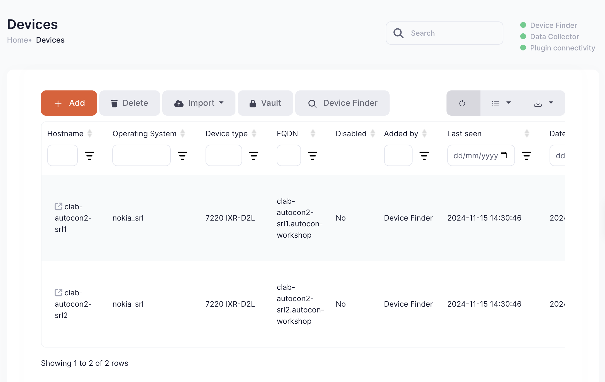
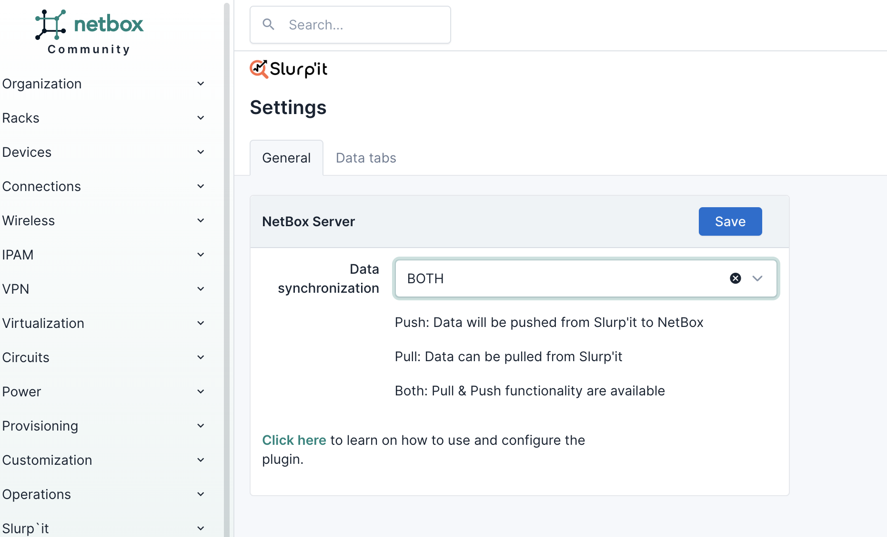
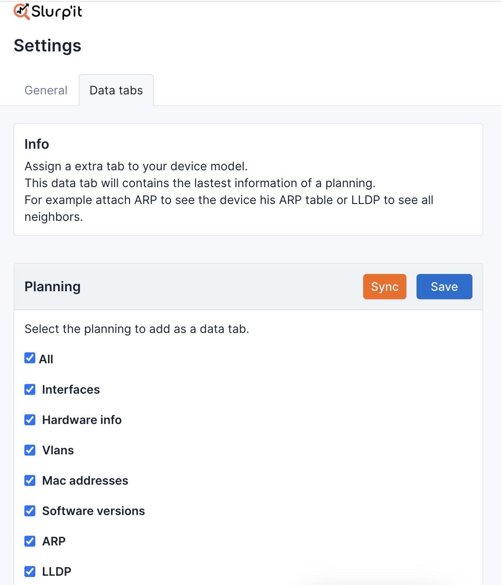
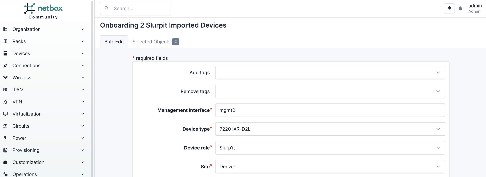
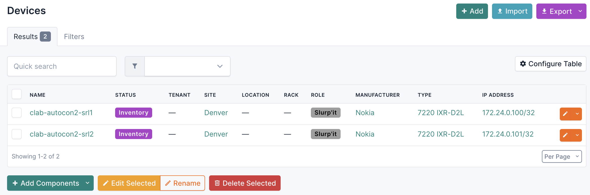
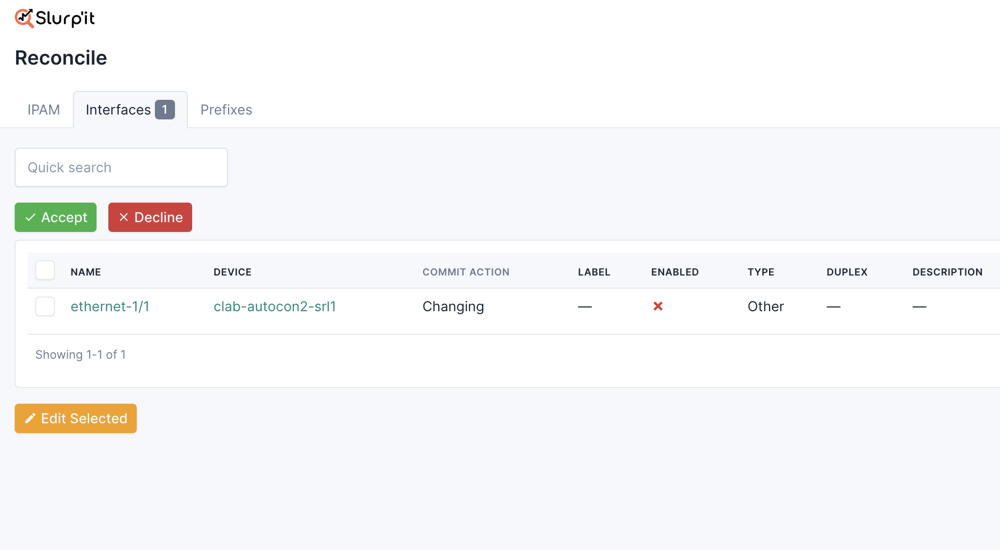

# Discovery and Reconciliation - Slurpit

Tools that are used to import operational state from our network into Netbox are typically called **Discovery** tools. Network Discovery typically falls into two categories:

1. Network discovery - Scans a list of IPs or subnets to find any network devices in the network
2. Device discovery - Logs into specific devices to extract their configurations

[Slurp'it](https://slurpit.io/) is a fully featured discovery tool. As the website says "If there’s a `show` command we can slurp’it!" Slurp'it can do network and device discovery across a large selection of network devices.

Let's slurp our network devices into Slurp'it using network discovery.
___

> [!TIP]
> This section requires switching between Slurpit and NetBox, so double check which tool you should be using at the beginning of each section

> [!TIP]
> 
> To make sure your network is in the right state for this section, you can use the following command:
> `./3_start_network.sh network/4.1_discovery_reconciliation

## Discovering our network

### Use Slurpit to find our devices

> [!TIP]
> **Slurpit URL**: `./0_set_envvars.sh | grep -i slurpit`  
> **username** admin@admin.com  
> **password** 12345678

Slurpit provides a `Device Finder` that will scan a subnet to find network devices. This has already been configured in the lab to scan `172.24.0.0/24` which is where our ContainerLab devies are running. Navigate to `Administrator` -> `Device Finder` and then click on `Start` in the top right.


Now navigate to `Devices` -> `Overview` and after a short wait you'll see our lab devices have been discovered.



### Onboard our devices into NetBox

Now that Slurp'it has discovered our network devices, we need to onboard those devices into NetBox. The Slurp'it team have built a plugin for NetBox to help with this, so let's dive in.

> [!TIP]
> **NetBox URL**: `./0_set_envvars.sh | grep -i netbox`  
> **username** admin  
> **password** admin

First we need to configure the Slurpit plugin in NetBox. Most of this has been preconfigured, but there are a couple of manual steps we need to do ourselves.

Navigate to the NetBox left-hand menu and click on `SLURP'IT` -> `Settings`


Select `BOTH` from the `Data Synchronization` dropdown menu, and click `Save`



Now click in the `Data tabs` tab, click `Sync`, then check `All` and then hit `Save`



---

Now that the plugin is configured, navigate back to the NetBox left-hand menu and click on `SLURP'IT` -> `Onboard devices`


If you now click `Sync` the Slurp'it plugin will pull the devices it has discovered in our network over to NetBox.


Now select both `clab-autocon2-srl1` and `clab-autocon2-srl2` click on `+ Onboard`. You'll see the Slurp'it device onboarding screen.

- Under `Management Interface*` enter `mgmt0`
- Under `Site*` select the `Denver` site that was pre-populated in NetBox
- Click `Apply` at the bottom of the form



Now the devices in our network have been successfully imported into NetBox! You can confirm this by returning to the NetBox homepage and navigating to `Devices` -> `Devices`



___

### Use Slurpit to discover additional device data

With Slurpit, pulling discovered network data into Netbox happens in two stages. The first step, which we just did, is to onboard the devices. The second step is to `Reconcile` the additional data about the devices into NetBox, but first we need to discover that additional  device data using Slurpit.

> [!TIP]
> **Slurpit URL**: `./0_set_envvars.sh | grep -i slurpit`  
> **username** admin@admin.com  
> **password** 12345678

In Slurpit navigate to `Devices` -> `Overview` and you'll see our lab devices. For both devices click on the ellipsis menu (three dots) on the far right side of device and click `Schedule Now`.


Slurp'it will take a short while to discover information about our devices. Then you can view the discovered information by clicking on the hostname on each device, and navigating to the `Collected data` tab. Feel free to explore the data Slurp'it has discovered about our devices. For example, under the `Interfaces` tab we can see the following:


### Reconcile discovered device data into NetBox

Finally, we need to reconcile the discovered addtional device data into NetBox. We do this using the Slurpit NetBox plugin.

> [!TIP]
> **NetBox URL**: `./0_set_envvars.sh | grep -i netbox`  
> **username** admin  
> **password** admin

In the NetBox left-hand menu click on `SLURP'IT` -> `Reconcile`


Select the `IPAM` tab, select all the IPs and then click `Accept`.


Select the `Interfaces` tab, select all the interfaces and then click `Accept`


Now the device interfaces have been added to the devices in NetBox. To confirm, navigate to `Devices` -> `Devices` -> `clab-autocon2-srl1` and select the `Interfaces` tab.


## Testing reconiliation

When we're getting started with intent-based network automation, the first important step is using discovery tools like Slurpit is populate our source of intent, NetBox. This gives us a baseline view of the network to compare against, but discovery tools have another purpose: detecting operational drift.

With our baseline view of the network in place, let's see how Slurpit can help us to detect operational drift, or differences between the network and our source of truth.

### Making a change in our network

First need to introduce some operational drift, let's do that by making a change in the network by disabling `ethernet-1/1` on `clab-autocon2-srl1`.

> [!TIP]
> 
> If you'd rather skip the manual steps, this command will prepare your network for the next practical section:  
> `./3_start_network.sh network/4.2_discovery_reconciliation`

> [!TIP]
> 
> **username** admin
> **password** NokiaSrl1!  

```
ssh admin@clab-autocon2-srl1
enter candidate
interface ethernet-1/1 admin-state disable
interface ethernet-1/1 subinterface 0 ipv4 admin-state disable
commit now
```

### Rediscovering device data in Slurpit

> [!TIP]
> **Slurpit URL**: `./0_set_envvars.sh | grep -i slurpit`  
> **username** admin@admin.com  
> **password** 12345678

This time instead of running the entire discovery, we can save ourselves a bit of time by just running discovery for interface details. Go to `Dashboard` the scroll down and under `Task Scheduler` click the `>` next to `Ìnterfaces`


Slurpit will now discover that the interface status for `ethernet-1/1` on `admin@clab-autocon2-srl1` has changed, and send it NetBox.

### Reconcile operational drift in NetBox

Now in NetBox

> [!TIP]
> **NetBox URL**: `./0_set_envvars.sh | grep -i netbox`  
> **username** admin  
> **password** admin

In the NetBox left-hand menu click on `SLURP'IT` -> `Reconcile`


Select the `Interfaces` tab, now you can see that Slurpit has found the operational drift.



 It's important to remember that when we discover operational drift, we don't always have to import it into NetBox.
 
 In this case we decide that the source of truth is correct and the network is wrong. `ethernet-1/1` on `clab-autocon2-srl1` _should_ be enabled, so there's an issue in the network and it should be fixed there.
 
 In this case, select the item and hit `Decline`
