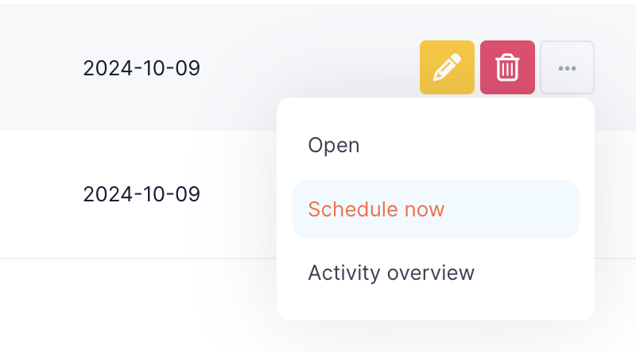
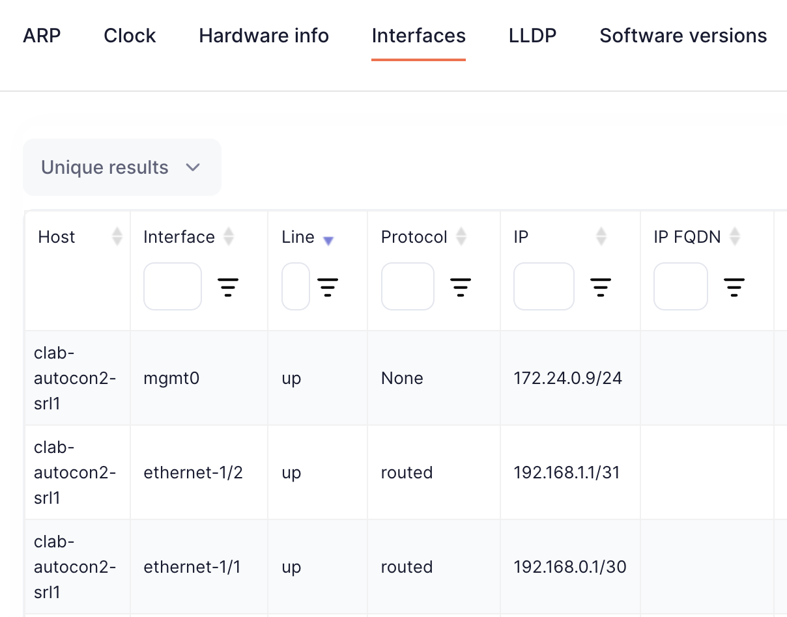
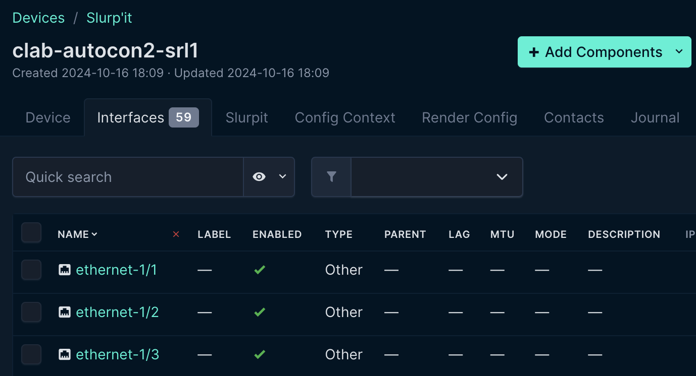

### Slurpit - Importing our devices from the network

**Discovering our Network with Slurpit**

Tools that are used to import operational state from our network into Netbox are typically called **Discovery** tools. Network Discovery typically falls into two categories:

1. Network discovery - Scans a list of IPs or subnets to find any network devices in the network
2. Device discovery - Logs into specific devices to extract their configurations

[Slurp'it](https://slurpit.io/) is a fully featured discovery tool. As the website says "If there’s a `show` command we can slurp’it!" Slurp'it can do network and device discovery across a large selection of network devices.

Let's slurp our network devices into Slurp'it using network discovery. First we need to get the IP and port for Slurp'it.

```
echo ${MY_EXTERNAL_IP}:${SLURPIT_PORT}
(Example output, yours will differ)
147.75.34.179:8000
```

> [!TIP]
> 
> **username** admin@admin.com  
> **password** 12345678

___

Navigate to `Devices` and you'll see our lab devices. Now we're ready to start our device discovery. Click on the ellipsis menu (three dots) on the far right side of each device and click `Schedule Now`.



Slurp'it will take a short while to discover information about our devices. Then you can view the discovered information by clicking on the new tab icon on each device, and navigating to the `Collected data` tab.

Feel free to explore the data Slurp'it has discovered about our devices. For example, under the `Interfaces` tab we can see the following:



___

**Importing the discovered network from Slurp'it into NetBox**

### Connect Slurpit to NetBox

- Log in to NetBox and navigate to `SLURP'IT` -> `Settings`
  - Under `Data synchronization` choose BOTH and click `Save`
  - Under `Slurp'it server` click `Edit`
    - Enter your Slurp'it URL
    - Enter the Slurp'it API token: `1234567890abcdefghijklmnopqrstuvwxqz`
    - Click `Save`
  - Go to `Data tabs` and under `Planning` click `Sync`
    - You'll now see a populated list of the all the data Slurp'it can reconcile into NetBox
    - Select `All` and then click `Save`

Now that Slurp'it has discovered our network, we need to import it into NetBox. The Slurp'it team have built a plugin for NetBox to help users intuitively reconcile the data in Slurp'it into NetBox, so let's dive in.

First navigate to your NetBox instance.

```
echo ${MY_EXTERNAL_IP}:${NETBOX_PORT}
(Example output, yours will differ)
147.75.34.179:8001
```

> [!TIP]
> 
> **username** admin
> **password** admin

In the NetBox left-hand menu click on `SLURP'IT` -> `Onboard devices`


If you now click `Sync` the Slurp'it plugin will pull the devices it has discovered about our network over to NetBox.


Now select both `clab-autocon2-srl1` and `clab-autocon2-srl2` click on `+ Onboard`. You'll see the Slurp'it device onboarding screen.

- Under `Management Interface*` enter `mgmt0`
- Under `Site*` select the `Denver` site that was pre-populated in NetBox
- Click `Apply`


Now the devices in our network have been successfully imported into NetBox! You can confirm this by returning to the NetBox homepage and navigating to `Devices` -> `Devices`


Pulling discovered network data into Netbox happens in two stages in Slurp'it. The step, which we just did, is to onboard the devices. The second step is to `Reconcile` the additional data about the devices into NetBox.

> [!TIP]
> 
> Slurp'it automatically pushes new data to be reconciled to NetBox every minute, but if you don't want to wait run this script
> `./slurpit/sync_to_netbox.sh`  

In the NetBox left-hand menu click on `SLURP'IT` -> `Reconcile`


Select the `IPAM` tab, select all the IPs and then click `Accept`.


Select the `Interfaces` tab, select all the interfaces and then click `Accept`


Now the device interfaces have been added to the devices in NetBox. To confirm, navigate to `Devices` -> `Devices` -> `clab-autocon2-srl1` and select the `Interfaces` tab.


