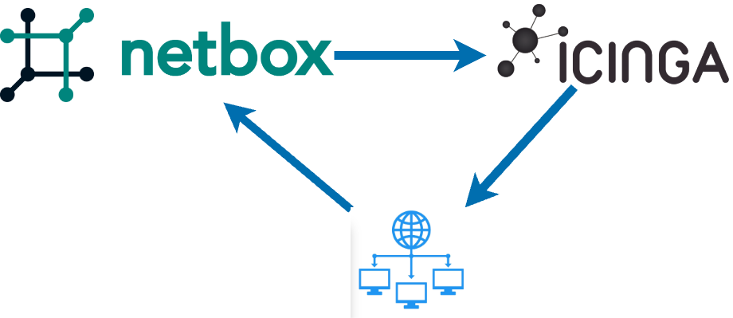

# Verifying Intent - Monitoring driven from your SoT

To make sure your network is in the right state for this section, you can use the following command: `./3_start_network.sh network/5.1_monitoring`

Monitoring can be defined as the process to check to see if the stuff we care about is working. 
When the monitoring tool can be configured from your Source of Truth, our intent can be verified.

[Icinga](https://icinga.com/) is a full featured, fully open source monitoring system. 

The [integration](https://github.com/sol1/icingaweb2-module-netbox) between Icinga and NetBox lets us configure monitoring from our SoT which creates a feedback loop. The  monitoring lets us know that the data in Netbox is valid.

As the integration is very mature, it can handle many data types and edge cases. In addition all manner of grouping can be provided, so for example, SNMP settings per device type or latency per site, or NTP servers per region can all be imported and configuration created in Icinga. 

Lets get started!

> [!TIP]
> **Icinga URL**: `./0_set_envvars.sh | grep -i icinga`  
> **username** icingaadmin  
> **password** icinga

The first step is to set the devices in Netbox to be imported by Icinga. Slurpit creates devices as status=Inventory by default, and Icinga needs them Active. 

Login to Netbox:
> [!TIP]
> **NetBox URL**: `./0_set_envvars.sh | grep -i netbox`  
> **username** admin  
> **password** admin

Go to: ``Devices -> Devices``, and Select both Devices and then click ``Edit Selected``. Set the Status to Active, and the Icinga import source Custom Field to Default. Click Apply.

The Custom Field allows for different monitoring "profiles" in the Icinga Director Import Sources.

Now login to Icinga and see if the devices turn and monitoring starts. It can take a minute or so to see them appear - go to ``Overview -> Tactical Overview``.

### Workshop Specific Plugin

For this workshop, we have a special check that pings the OTHER Nokia device from each device. This is controlled by the custom field ping_target, and if you set this to the valid tatget, the ping will come from the nokia device itself. 

Once the device automatically imports into Icinga, you can see the checks being applied automatcaily. This incldues ping (of the primary IP), SSH, an SNMP uptime command. These Icinga Services are applied automatically when a device with the Netbox manufacturer Nokia is created as an Icinga Host. The concept of Icinga Apply Rules is very powerful, and means we can use any Netbox Data to create a dynamic and accurate set of Services.

### Bonus Other Checks

We have also included other checks in the Icinga configuration, which can check SSL certifcates, as an example. 
To try this out
1. Add a device, or virtual machine to Netbox, and set it to Active, import_source default, and it should get a ping check.
2. Add to the same Netbox device/virtual machine a service using the service template `SSL -` and set the service's Icinga list custom field a fqdn or comma seperated fqdn's, the Icinga automation will add to the hosts service that check the SSL certificate for those fqdn(s). For example, you could add a device called google, give it a valid Google IP, and setup a service for SSL with the ssl_hostname set to www.google.com, Icinga will automatically create the host and setup a service that checks the certifcate for you. 

There is much more power available to this integration, and once you realise that Netbox can drive the config of your monitoring completely, it becomes easy and sustainable.

### Notifications

As another bonus option, the Netbox Contacts can be imported, and assigned to devices or virtual machines. Using a Contact Assignment, of type 'engineer' we can effectivel subscribe to alerts from this device. This gives us a powerful way of documenting the relationships between man and machine, and making sure the right person gets the right alerts.
Go ahead and add yourself as a contact, and add your email. Assign a dveice to yourself and try it out.

