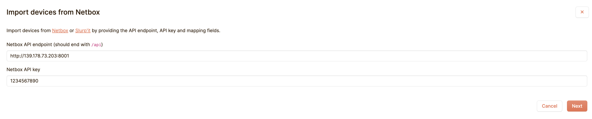
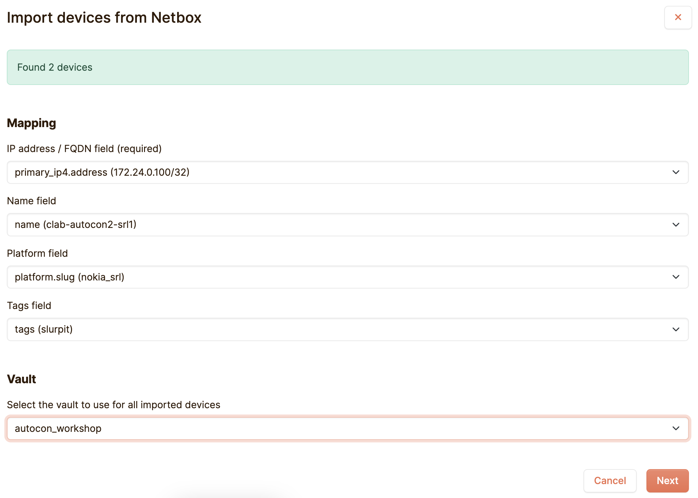

### Netpicker - Our configuration assurance tool

Netpicker allows us to validate our device configurations. It can be used to validate anything you can express in code, but also makes it easy to generate validations even if you can't code. Perhaps you'd like to know if there are any known vulnerabilities for a platform version you're running in your network, or if your device configurations adhere to your company's security policies? Netpicker can do all of that and more.

To get started we need to tell NetPicker about our devices. Now that we have NetBox as our Network Source of Truth, we'll be importing our devices from NetBox into Netpicker.

First log-in to Netpicker and click on `Add Device`

```
echo "http://${MY_EXTERNAL_IP}:${NETPICKER_PORT}"
(Example output, yours will differ)
http://139.178.74.171:8003
```

> [!TIP]
> 
> **username** admin@admin.com  
> **password** 12345678


Now click on `+ Add devices` and then click on `Import from NetBox`


Then provide your NetBox URL, NetBox API key (1234567890) and click `Next`

```
echo "http://${MY_EXTERNAL_IP}:${NETBOX_PORT}"
(Example output, yours will differ)
http://139.178.74.171:8001
```



Then on the next screen choose `IP address / FQDN field (required)` choose `name (-)`and under `Vault` select `autocon_workshop`. Then click `Next`



Our network devices have now been imported from NetBox into Netpicker!

___

Next we need to ask Netpicker to pull the configuration backups for our devices so that we can run tests, which Netpicker calls `Policies`, against them.

On the `Devices` screen click `Run backups`

INSERT RUN BACKUPS SCREENSHOT

Navigate over to `Backups` and wait for the backups to arrive. You can hit `Refresh` to update the view until both backups report `Success`.

INSERT BACKUPS SCREENSHOT

You can now inspect the backups. Click on `clab-autocon2-srl1`. Then you can click on each backup to view it.

INSERT BACKUP DETAILS VIEW

Now that Netpicker is pulling the backups from our devices, we can use the real power of Netpicker, `Policies` and `Rules`.