**Section 6 - Configuration Assurance - Netpicker**

- Network - 6.1_assurance (no NTP)
- Add devices from NetBox
    - Automate adding the NetBox details
- Backup the devices
- Add Simple rule - “ntp” should be present
- Run policies, show that they fail

- Network - 6.2_assurance (with NTP)
- Backup the devices
    - Look at the diff
    - Sometimes seeing failures in the backups, rerunning them fixes it (need to update to the latest versions)
- Run policies, show that they pass

- Python test - hostname in NetBox is present in the config
    - Update Nokia devices to change the hostname
    - Show that the python test fails
- Run policies, show that they have been passing


### Netpicker - Our configuration assurance tool

> [!TIP]
> Make sure your lab devices are in the correct state by running:
> `./3_start_network.sh network/6.1_assurance/`  

Netpicker allows us to validate our device configurations. It can be used to validate anything you can express in code, but also makes it easy to generate validations even if you can't code. Perhaps you'd like to know if there are any known vulnerabilities for a platform version you're running in your network, or if your device configurations adhere to your company's security policies? Netpicker can do all of that and more.

To get started we need to tell NetPicker about our devices. Now that we have NetBox as our Network Source of Truth, we'll be importing our devices from NetBox into Netpicker.

First log-in to Netpicker and click on `Add Device`

> [!TIP]
> **Netpicker URL**: `./0_set_envvars.sh | grep -i netpicker`   
> **username** admin@admin.com  
> **password** 12345678


Now click on `+ Add devices` and then click on `Import from NetBox`


Then provide your NetBox URL, NetBox API key and click `Next`

> [!TIP]
> **NetBox URL**: `./0_set_envvars.sh | grep -i netbox`  
> **NetBox API Key**: `1234567890`


Then on the next screen under `Vault` select `autocon_workshop`. Then click `Next`


Our network devices have now been imported from NetBox into Netpicker!

___

Netpicker is a powerful tool for staying in control of our device configurations. Let's first ask Netpicker to backup our device configurations. On the `Devices` screen click `Run backups`


Navigate over to `Backups` and wait for the backups to arrive. You can hit `Refresh` to update the view until both backups report `Success`.

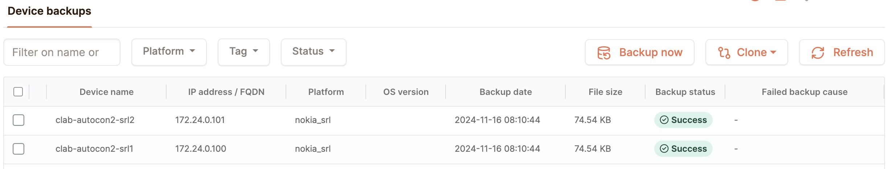

You can now inspect the backups. Click on `clab-autocon2-srl1`, and then click on the backup to view it.

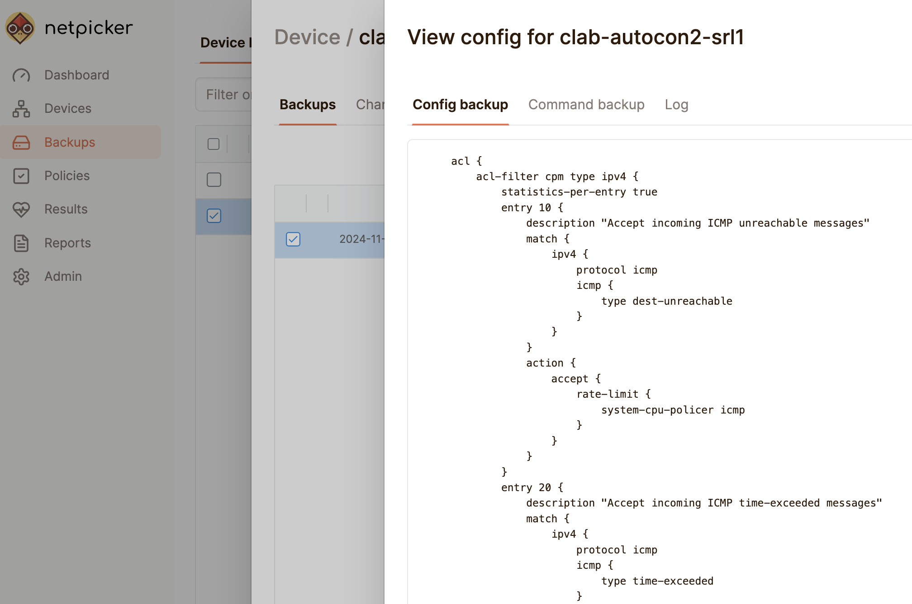

___

Now that Netpicker has pulled the configuration backups from our devices, we can use the real power of Netpicker, `Policies` and `Rules`. `Policies` are logical groupings of `Rules`. There are two different types of `Rules`:

1. Simple rules - require no coding knowledge and can be used to express simple checks against our configuration backups using plain text or regexes
2. Python rules - allow you to use the Python language to create powerful checks that can also include input from NetBox

#### Creating a Netpicker simple rule

Let's start by creating a simple rule to check if `ntp` is configured on our devices. First we need to create a `Policy` for our simple rule to live in. Click on `Policies` in the left hand menu bar, and then `+ Create Policy` in the top right. Give your policy a name, and then click `Create`.

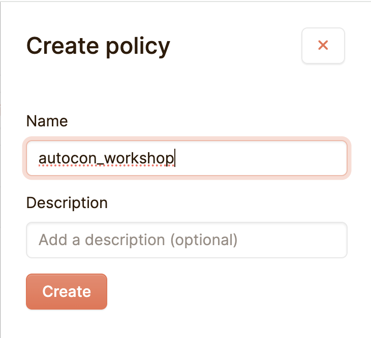

You'll now be taken to your new policy. Click `+ Add Rule` in the top-right. Fill in the following details and click `Save`.

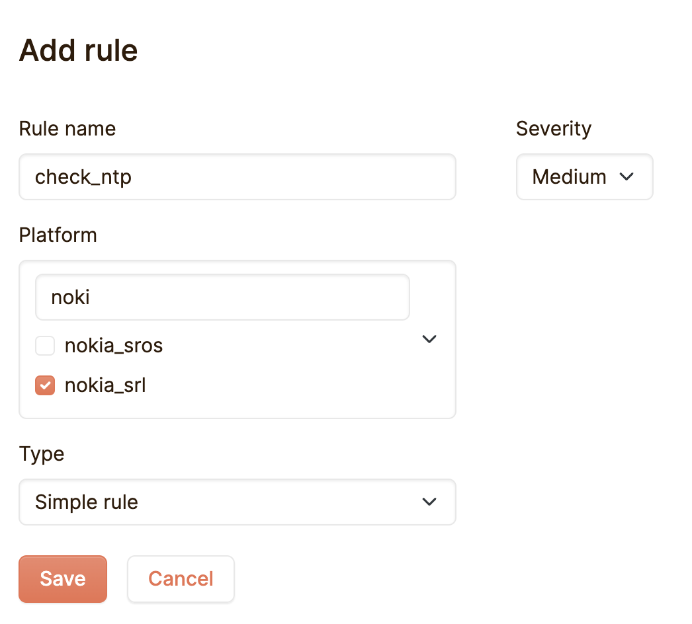

You'll now be taken to your new rule. Click on `Properties`, where you can now configure your rule. In this case we're going to define a very simple rule which just checks for the existence of the string `ntp` in the device's configuration backup.

In the textbox under `Must include the text:` add `ntp` and then click `Save`.

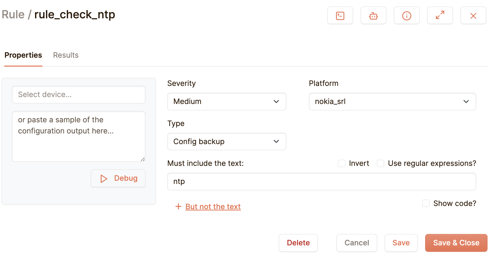

Now our Netpicker simple rule is configured, we can test it. Netpicker provide a handy debug mode, we can use to test our rules. In the textbox above the `Debug`button enter `clab-autocon2-srl1` and then click `Debug`.

After a few seconds you'll see the output of the debug run on the right. In this case, the rule is `Not compliant` meaning that `ntp` is not configured on this device, because the string `ntp` cannot be found in the configuration backup.


Try the same, but this time with `clab-autocon2-srl2`. When you're done testing hit `Save & Close`. You'll now be taken back to the policy you created earlier.

#### Creating a Netpicker Python rule

As mentioned earlier, Netpicker Python rules afford us much more flexibility, because we can write our tests in code. Python rules also allow us to query the Source of Truth, NetBox. Let's create a Python rule to check if the hostname on the device, is the same as it's hostname in NetBox!

In your policy, click `+ Add Rule` in the top-right. Fill in the following details and click `Save`.

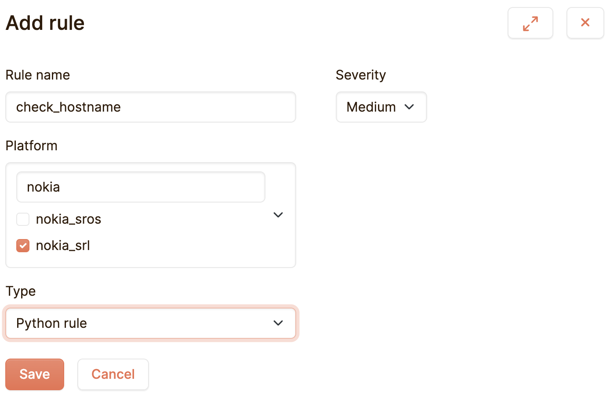

You'll now be taken to your new rule. Click on `Properties`, where you can now configure your Python rule. In this case our rule is going to check that the `hostname` defined in NetBox appears in the device's configuration backup.

In the code editor on the right, remove the current content, replace it with the code below and then click `Save`.

```
@medium(
    name='rule_check_hostname',
    platform=['nokia_srl'],
    # commands=dict(version='show version')
)
def rule_check_hostname(configuration, commands, device):
    assert device.name in configuration
```

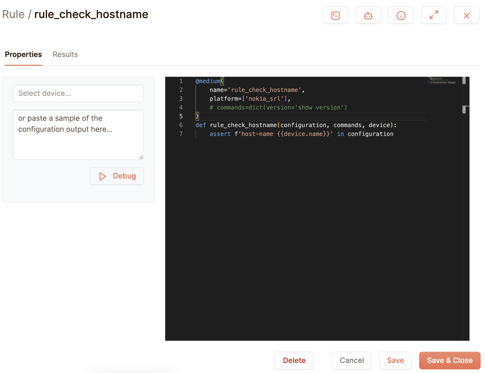

As with our simple rule, you can now use the Netpicker rule debugger run the rule against `clab-autocon2-srl1`.

After a few seconds you'll see the output of the debug run on the right. In this case, the rule is `Not compliant` meaning that the `hostname` in NetBox is not present in the device's configuration backup.


Try the same, but this time with `clab-autocon2-srl2`. When you're done testing hit `Save & Close`. You'll now be taken back to the policy you created earlier.

#### Making our network compliant

We now have two Netpicker rules set up to help us check when our device configurations are not compliant. Our simple rule states that `ntp` should be configured on the devices, and our Python rules states that the `hostname` in the device configurations must match the `hostname` in NetBox. Both are currently failing, so let's fix that.

> [!TIP]
> 
> If you'd rather skip the manual steps, this command will make your lab devices compliant:  
> `./3_start_network.sh network/4.2_discovery_reconciliation`

First let's fix `clab-autocon2-srl1`.

> [!TIP]
> 
> **username** admin
> **password** NokiaSrl1!  

```
ssh admin@clab-autocon2-srl1

# First fix NTP
enter candidate
/ system ntp admin-state enable
/ system ntp network-instance default server 0.pool.ntp.org
/ system ntp network-instance default server 1.pool.ntp.org
commit now

# Then fix the hostname
enter candidate
/ system name host-name clab-autocon2-srl1
commit now
```

> [!TIP]
> 
> Use `Ctrl+D`to exit the Nokia SR Linux CLI

Now let's fix `clab-autocon2-srl2`.

> [!TIP]
> 
> **username** admin
> **password** NokiaSrl1!  

```
ssh admin@clab-autocon2-srl2

# First fix NTP
enter candidate
/ system ntp admin-state enable
/ system ntp network-instance default server 0.pool.ntp.org
/ system ntp network-instance default server 1.pool.ntp.org
commit now

# Then fix the hostname
enter candidate
/ system name host-name clab-autocon2-srl2
commit now
```

> [!TIP]
> 
> Use `Ctrl+D`to exit the Nokia SR Linux CLI

#### Check the compliance of our network

We have now configured `ntp` and added the correct `hostname` for each of our lab devices, so our network should be compliant. First let's manually inspect the differences.

First we need to ask Netpicker to pull the device configurations again. As we did earlier, go back to `Backups` and click `Backup Now`. 

You can hit `Refresh` until the you see the `Backup date` column has been updated to the current time, showing us that new configuration backups have been pulled from our devices. Click on `clab-autocon2-srl1` and you'll see that we now have two backups.

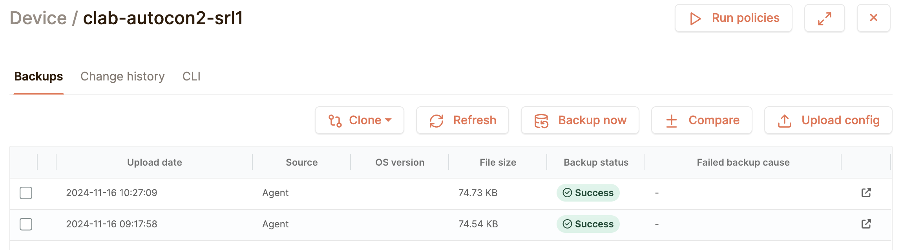

___

Let's compare the two backups to see what has changed. Check the checkboxes on the left of each backup and then click `± Compare`.

> [!TIP]
> 
> If you used the `tip` to skip the manual configuration you'll see a lot of differences between the two backups.  
> This is because to skip the manual steps we recreate the devices under the hood, which leads to the certificates being regenerated.

Scroll through the differences between the two configurations until you find the `hostname` section.


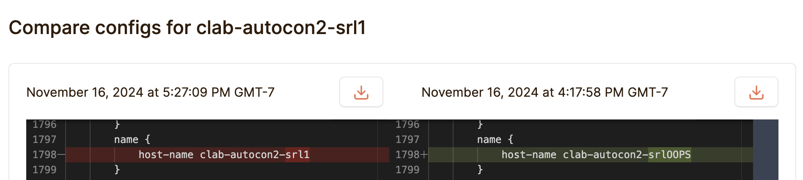

Keep scrolling until you find the `ntp` section.

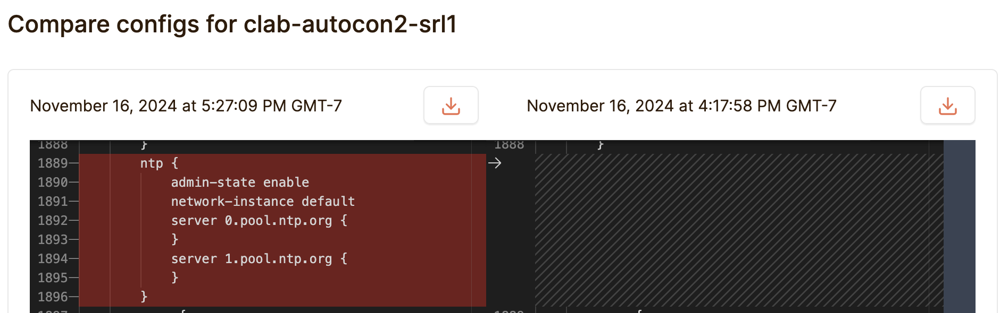

Our changes look good. Let's see if Netpicker policy agrees!

___

#### Run the policy

So far we have been using Netpicker's debug mode to run our rules, but running individual rules per device doesn't scale very well, so let's run our whole policy in one go.

Click `Policies` on the left hand menu bar and then hit `Run Policies`. After a short while, you should see that 4 rules have run successfully.

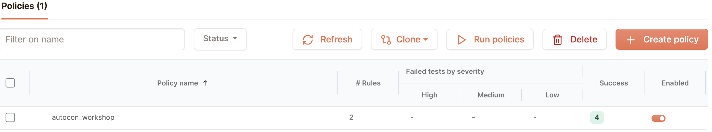