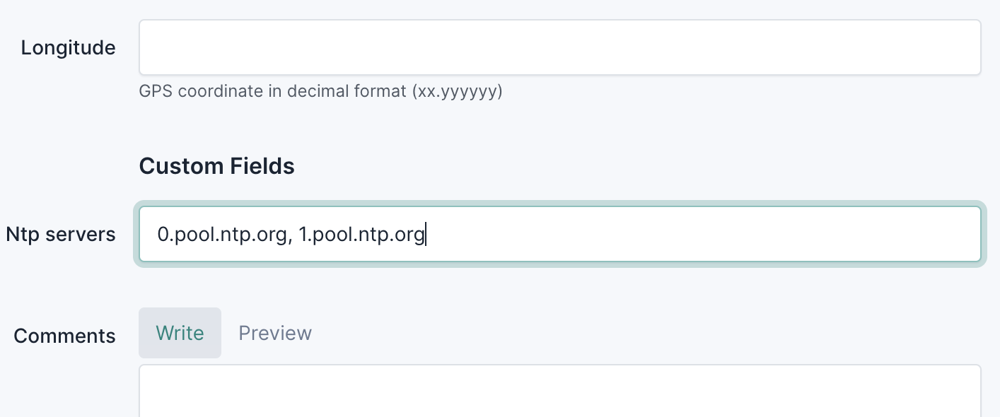

# Section 7 - Automated Network Changes - Ansible

You may be surprised that we're only getting to automating network changes in the last section of the workshop, afterall, isn't automation about making changes to the network?

When we first reach for automation it's often because we're not really in control of our networks. We don't know exactly what is out there, how it is configured, and who is configuring it. Adding automated network changes in a situation like this can make things worse, not better.

To proceed safely and quickly with our automation efforts, we must first make sure we have a good sense of what is going on in the network, so that's we're we started.

- Slurpit tells us if the network still matches our intent
- Icinga tells us if the network is still behaving as we expect
- Netpicker tells is if the network devices are still configured correctly

Each of these systems is reading data from NetBox, examining the operational state of the network and taking some action. Imagine having to maintain all of these systems without NetBox to give us a shared view of the intent of the network. It would be tedious and error prone, exactly what we're trying to get away from when we start automating our networks.

> [!TIP]
> 
> To make sure your network is in the right state for this section, you can use the following command:
> `./3_start_network.sh network/7_automated_network_changes

## Using our Source of Truth to drive changes to the network

So far you’ve either been manually updating the network (or to save time, you’ve been faking it by using the cheat tips). Let's introduce some device automation so we can use the intent in NetBox to automatically update our devices and see how the other tools help us to stay in control.

### Updating NTP settings

In **Section 5 - Monitoring - Icinga** we made some manual changes to our devices to add NTP to our devices and checked the configurations with Netpicker. That exercise was both error prone and time consuming, even with just 2 devices. Now imagine you have thousands!

Let's imagine we've decided that `ntp` settings should be site-wide in our network. The NetBox data model is highly extendible and gives us a few ways to do this, but we will be using Custom Fields. Let's add our site-wide `ntp` servers for our devices in NetBox.

___

> [!TIP]
> **Slurpit URL**: `./0_set_envvars.sh | grep -i netbox`  
> **username** admin  
> **password** admin  

In NetBox navigate to `Organization` -> `Sites`. Click on our `Denver` site and then click `Edit`.

Scroll down to **Custom Fields** and enter our `ntp` servers in the `Ntp servers` field as a comma separated list like this: `0.pool.ntp.org, 1.pool.ntp.org`



Then click `Save`
___

> [!TIP]
> Automation will only be applied to devices that are set to `Active` in NetBox.

Now we've updated NetBox with our intent for the network, we can deploy the changes. There are many tools to choose from when it comes to automating network changes but we've chosen Ansible. Before we automatically update our network devices from the intent in NetBox, let's walk through what the automation is doing under the hood. There are a few steps:

1. Set up the Python environments for Ansible to run it
2. Connect to our NetBox instance and extract device and site information, including our `ntp` servers
3. Process the information from NetBox into a format that can be sent to the devices
4. Connect to each device in NetBox and apply the correct configuration

Let's give it a try!

```
./deploy_changes.sh
```

If all goes well you should see these lines in the output:

```
TASK [Debug message when no NTP servers are defined] ************************************************************************************************************************************************
ok: [clab-autocon2-srl1] => {
    "msg": "ntp_config: {'network-instance': 'default', 'admin-state': 'enable', 'server': [{'address': '0.pool.ntp.org'}, {'address': '1.pool.ntp.org'}]}"
}
ok: [clab-autocon2-srl2] => {
    "msg": "ntp_config: {'network-instance': 'default', 'admin-state': 'enable', 'server': [{'address': '0.pool.ntp.org'}, {'address': '1.pool.ntp.org'}]}"
}
```

### Check that the automation worked

Now let's double check that the `ntp` settings were correctly applied on our devices. First on `clab-autocon2-srl1`.

> [!TIP]
> 
> **username** admin
> **password** NokiaSrl1!  

```
ssh admin@clab-autocon2-srl1

# info system ntp
    system {
        ntp {
            admin-state enable
            network-instance default
            server 0.pool.ntp.org {
            }
            server 1.pool.ntp.org {
            }
        }
    }
```

> [!TIP]
> 
> Use `Ctrl+D`to exit the Nokia SR Linux CLI

Now on `admin@clab-autocon2-srl2`.

> [!TIP]
> 
> **username** admin
> **password** NokiaSrl1!  

```
ssh admin@clab-autocon2-srl2

A:clab-autocon2-srl2# info system ntp
    system {
        ntp {
            admin-state enable
            network-instance default
            server 0.pool.ntp.org {
            }
            server 1.pool.ntp.org {
            }
        }
    }
```

Great, we just deployed our first intent-based change. Now imagine that we have thousands of devices, how would we be sure that our automation had deployed the changes correctly, other than waiting for our users to start creating angry support tickets?

This is exactly why we spent most of the workshop focussing on other areas of the network automation reference architecture! Remember that Netpicker pulls it's devices from NetBox. So if we had thousands of devices in NetBox, Netpicker could automatically import them and run its policies against them.

> [!TIP]
> 
> **Exercise** Go back to Netpicker, create new backups for our devices, and then run the policy. The NTP check should pass!

_____

Still to do...

- Think of a test that would affect Icinga and another that would affect Netpicker


**This section needs to be moved into a summary section of its own**

See the pattern here... we add the change to NetBox... then we update the network. Let's look back at the problems we discovered in the first slide.....

- 8 commands to apply the changes and 1 command to confirm them.
- When we were SSHing into that device, we didn’t really know what we were going to find because we have no documentation. What if other engineers have been making changes?
- We also need to now go back and update our documentation (if it exists) so that future engineers will know what they are getting themselves into when they SSH into the devices. How do we ensure that the documentation is updated when many engineers are making changes to the network?
- When making changes to the network, we also need to coordinate with the monitoring team, or risk creating a bunch of false positive alerts, wasting our colleagues time.
- How can we confirm that our devices are correctly (and securely) configured?
- If we're ever audited, we may be asked to show the reason why this change was made and by whom. How could we correlate our ITSM ticket to all those changes?